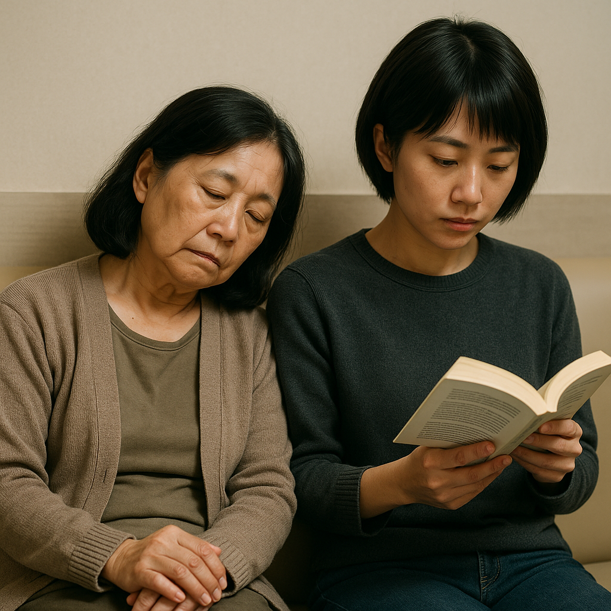

我是個很急躁的人，等紅燈急躁、等電梯也急躁、與人家談沒有效率也急躁。現在重病的我也感到急躁，我想要這個大幅度干擾我生活與工作的病趕緊好起來，他必須好起來，rTMS必須要有效果。

每天清晨天才剛亮，媽媽就會到我的房間把我喚醒，我會馬上從稍微放鬆的狀態馬上進入警戒狀態，媽媽總是會準備我的早餐：一顆水煮蛋，但我從來沒吃，我真的食不下嚥。支持我起床梳洗後爬上車子躺在後車廂的動力只有我即將要去做那個手術，而那個手術是我快速回復職場的唯一希望。

在一個小時的路途中，我幾乎沒有力氣探望窗外的風景，我會在後車廂蜷曲成一個我認為安全的姿勢，並且閉眼保持這個姿勢直到車子搖搖晃晃的開進醫院。我還記得馬偕醫院的停車場不是很好停車，在停車的時候媽媽與姊姊會因為緊張而起小爭執，這些爭執讓我有感到焦慮，但我沒有說出來，我就是一直保持著異常的沉默。

搭車是種煎熬、等待叫號是種煎熬、進入診間讓探頭持續的用電波打進腦袋的痛楚是一種煎熬，心理對於家人舟車勞頓載我來醫院後又要在外面等我一個小時的療程的愧疚感，又是另一種煎熬。

做完療程後，我常常假借上廁所的名義偷偷抽我的加熱菸，其實沒有任何手段可以讓我感到良好，我只是用手邊有的資源不斷的嘗試，也許抽根菸我會感覺好一點？但通常現實是我持續的恐慌與痛苦。

回到等待區與媽媽和姊姊會合，我將單次的費用5,000元轉帳給醫院，這時我意識到我拿著爸爸的錢付醫療費，讓姊姊與媽媽載我去醫院，在我療程的時候讓他們無聊的等待，然後還仰賴他們載我回家。

我雖然很不舒服，但我也感受到家人為了我，做了好多好多。

媽媽常跟我講一句話：不要在意我們的付出，如果是你，妳也會對我做同樣的事情。

媽媽，我以前不認同妳，我也不想變成妳想要的樣子：一個死讀書的乖小孩。但這次，我不想辜負妳，謝謝妳照顧我、照顧外婆，當妳有需要的時候，我也會盡力照顧妳。

