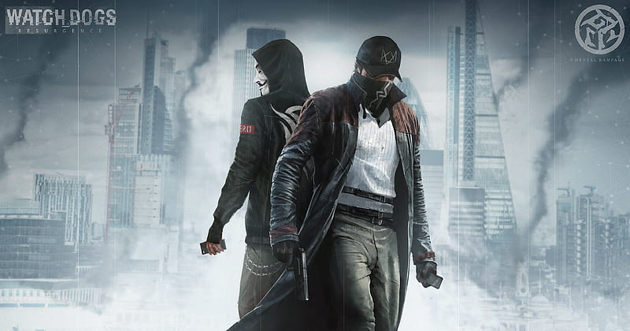

---
# the default layout is 'page'
icon: fas fa-info-circle
order: 4
---

灰帽子不站在黑或白其中一邊，而是願意走進灰色地帶把事情看清楚——像《看門狗》的 Aiden Pearce 那樣：不把規則當成唯一答案，也不把「集體共識」當成真理。

我更相信的是一套能自我驗證、能承擔後果的道德標準：先理解動機與脈絡，再做選擇；先把真相挖出來，再談立場。

這裡的每一篇文字，都是我用理性和共感去拆解世界的練習——不盲從、不煽動、不偽善，只求更接近真實，並對自己的行動負責。
