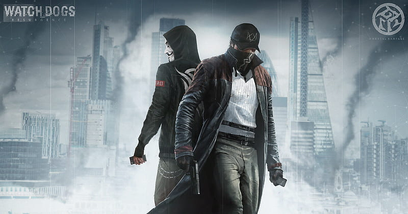

---
# the default layout is 'page'
icon: fas fa-info-circle
order: 4
---

灰帽子一詞源自於灰帽駭客，一種夾雜在黑帽與白帽中間，同時參與雙向網路攻防的駭客類型。

而灰帽精神代表著不是非黑即白的世界觀，像《看門狗》的 Aiden Pearce 那樣：不把規則當成唯一答案，約束灰帽的不是法律、社會的道德與「集體共識」，灰帽更相信的是一套能自我驗證、能承擔後果的道德標準，先理解背景、動機與脈絡，先洞察人性與共感再去評斷事情。

不盲從、不煽動、不偽善，只求更接近真實，並對自己的行為負責。
